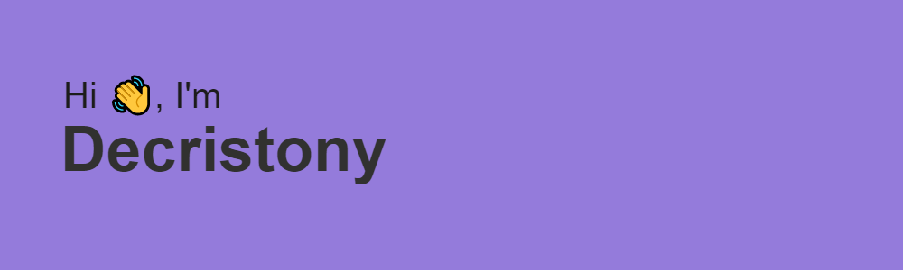

## Olá eu sou Decristony

- 💻 Hoje trabalho com front-end 
- 📚📚Estudando: React, Node, Typescript e Wordpress(para freela).
- 📘📘📘 Confira meu portfolio aqui 👉 https://decristony.github.io/Portfolio-/

  <a href="https://decristony.github.io/Portfolio-/">
  
  

 
  
  
  
  
  
  
   
   
   

